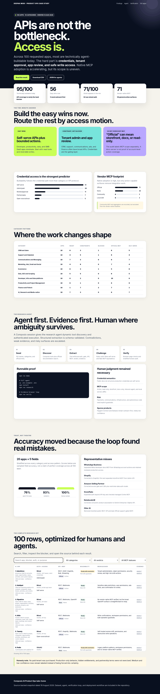

# Composio 100-App Agent Toolkit Audit

A reproducible Product Ops case study across 100 requested apps. The checked-in dataset records category, auth, credential gate, API breadth, vendor MCP status, buildability, blockers, confidence, and source URLs.

**[Open the live case study](https://deepakmodidev.github.io/composio-100-app-audit/)** · **[Browse the source](https://github.com/deepakmodidev/composio-100-app-audit)**



## Two-minute result

- **95 of 100** are technically agent-buildable today.
- **7** are partner or sales-gated. **5** are blocked without outreach.
- **71** explicitly document OAuth in their auth mix. **62** use multiple auth patterns rather than one universal method.
- **71** have a vendor-native MCP surface. **58** are general account-action surfaces; the rest are read-only, limited, storefront, docs, developer, local, or bridge-oriented.
- Verification moved from **76/100** correct sampled fields to **93/100** after validators, then **100/100** after manual source review. This is sample accuracy, not a claim that every field in all 100 rows is perfect.

Open `index.html` for the case study.

## Proof without keys

```bash
npm run demo
```

## Run the research agent

Requires Node.js 22.22.3 or newer, matching the current Composio TypeScript SDK requirement.

```bash
cp .env.example .env
npm install
npm run research
```

The agent creates one Composio session, awaits `session.tools()` for dynamic tool discovery, researches each app against official sources, validates structured output with Zod, checks identity drift, resumes from checkpoints, and saves after every app.

## Verification loop

```bash
npm run validate
npm run verify
```

The deterministic validator flags contradictory access, MCP, evidence, and verdict combinations. The Playwright verifier loads every evidence URL and records status and page title. Low-confidence, contradictory, renamed, or gated rows are escalated to human review. The checked-in `data/verification.json` contains a stratified 20-app, 100-field source audit with honest corrections.

## Files

- `data/apps.final.json` and `data/apps.csv`. Final research dataset.
- `data/apps.first-pass.json`. Pre-verification snapshot.
- `data/verification.json`. Accuracy progression and correction log.
- `data/validator-flags.json`. Remaining items escalated for human review.
- `src/research-agent.ts`. Composio and OpenAI research loop.
- `scripts/validate.mjs` and `src/validate.ts`. Deterministic contradiction checks.
- `src/verify.ts`. Browser verification loop.
- `index.html`. Self-contained case study.

## Deploy to GitHub Pages

1. Create an empty GitHub repository.
2. Push this folder to `main`.
3. Open **Settings → Pages** and select **GitHub Actions**.
4. The included `.github/workflows/pages.yml` publishes the static case study.

## Human judgment was required for

1. Whether a public developer portal actually means production credentials are self-serve.
2. Native action MCP versus docs-only, storefront-only, inbound-agent, or community MCP.
3. Product renames and ambiguous targets such as Paygent Connect and fanbasis.
4. High-risk finance, messaging, infrastructure, and autonomous-code actions.

## Honest limitations

No paid tenant was purchased. Production behavior, hidden enterprise entitlements, and partner contracts were not exercised. Evidence is dated 18 August 2026. Low and medium confidence rows remain visibly labeled.
